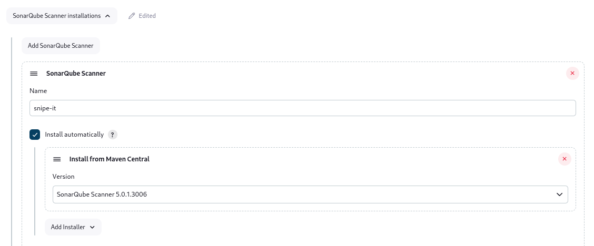
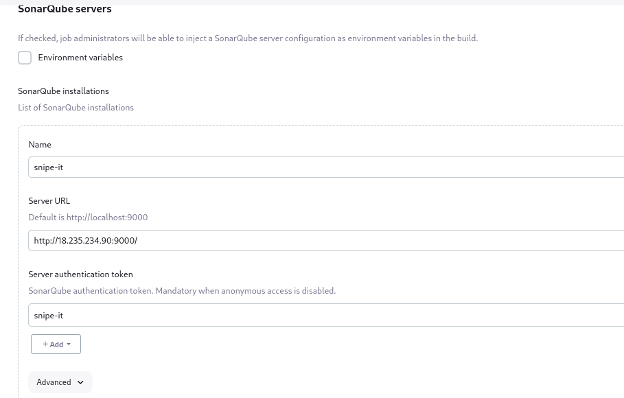

The ansible configuration is in this directory, spin up instances to serve for the jenkins server, webserver, database server and sonarqube server, in further projects we will be automating deployments of the infrastructure with terraform but for now we will be automating the configuration. For the Jenkins server allow `port 8080` and for the sonarqube server allow `port 9000`.

In the ansible-config-management folder, edit the inventory file with the ip-address of the instance spinned up, set the path of the private key path in ansible.cfg also copy the public key to `./ssh/authorized_keys` on your servers. Then ping the instance with:

```sh
ansible -m ping all
```

Proceed to run the configurations against the server, setting up the webserver, database server, sonarqube and jenkins server tasks.

```sh
ansible-playbook  -K root-playbooks/prod.yml
```

After succesful deployment, access the sonarqube server `<public-ip-address>:9000` the default username and password is `admin` respectively. Generate a token by clicking on the avatar of the administrator > My account > Generate token. After set the webhook for the jenkins server, click on administration > configuration > webhooks. Set the webhook just like this `http://<jenkins-server>/sonarqube-webhook/`. Click on save

Login to your jenkins server, navigate to manage jenkins > plugins, install sonar scanner plugins. Then navigate to manage jenkins > Tools to set up the sonnar scanner installations. 



Then setup the sonarqube server, navigate to manage Jenkins > System > Sonar Scanner. For the server authentication token, click on add, add a secret file with the previously generated token from sonarqube.




Create a pipeline, In the definition section you can either create a pipeline script or pipeline script from scm, using from pipeline script, click on try sample pipeline > hello word to get a script template, CLick on pipeline syntax to be able to generate a pipeline script yourself using the sample step. Here is the script to use below

```sh
pipeline {
  agent any

  stages {
    stage('Authenticate to GitHub') {
      steps {
        git branch: 'snipe-it',
            url: 'https://<pat-token>:oxblixxx@github.com/oxblixxx/snipe-it/'
      }
    }

    stage('SonarQube Quality Gate') {
      environment {
        scannerHome = tool '<jenkins-sonarqube-tool-name>'
      }
      steps {
        withSonarQubeEnv('<jenkins-sonarqube-tool-name>') {
          sh "${scannerHome}/bin/sonar-scanner"
        }
      }
    }
  }
}
```

Click on apply, save then run the build. Notice that the Sonarqube quality gate stage fails. Go to the Jenkins instance, update the `/var/lib/jenkins/tools/hudson.plugins.sonar.SonarRunnerInstallation/snipe-it/conf/sonar-scanner.properties` directory with the below content

```sh
sonar.host.url=http://<sonarqube-url>:9000
sonar.projectKey=snipe-it
#----- Default source code encoding
sonar.sourceEncoding=UTF-8
sonar.php.exclusions=**/vendor/**
sonar.php.coverage.reportPaths=build/logs/clover.xml
sonar.php.tests.reportPath=build/logs/junit.xml
```

For the `projectKey` must be a unique name of your choice. Run the build again. It should run succesfully now.
 


