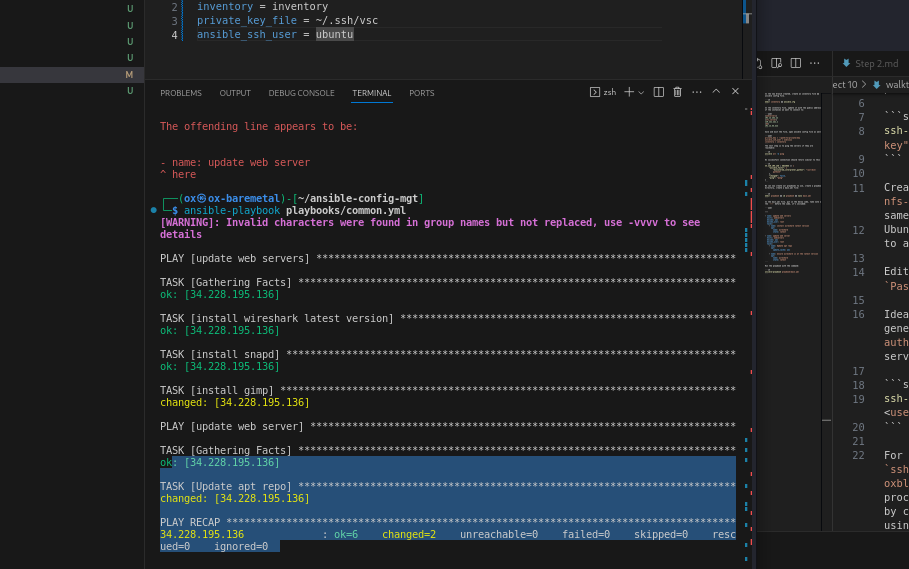

In the new branch created, create an inventory file && ansible config file.

```sh
mkdir inventory && ansible.cfg
```

In the inventory file, update it with the public address of the instances we want to connect to:

```yaml
[webservers]
192.12.232.12
[nfs_server]
129.121.121.1
[db]
192.12.43.212
```

Save and exit the file, open ansible config file as well:

```yaml
private_key = ~/path/to/private/key
ansible_ssh_user = oxblixxx
inventory = inventory
```
The next step is to ping the servers if they are reachable:

```sh
ansible all -m ping
```

On successfull connection should return similar to this

```sh
34.228.195.136 | SUCCESS => {
    "ansible_facts": {
        "discovered_interpreter_python": "/usr/bin/python3"
    },
    "changed": false,
    "ping": "pong"
}
```

We can now create our playbooks to use, create a playbook directory, create a main.yml file:


```sh
mkdir playbook && cd playbook && nano main.yml
```

In the main.yml file, put in the below code, take note of the `---` before the code, it's included:

```yaml

---

- name: update web servers
  hosts: webservers
  become: yes
  become_user: root
  tasks:
    - name: install wireshark latest version
      apt:
        name: wireshark
        state: latest

    - name: install snapd
      apt:
        name: snapd
        state: latest

    - name: install gimp
      apt:
        name: gimp
        state: latest

- name: update web server
  hosts: webservers
  become: yes
  become_user: root
  tasks:
    - name: Update apt repo
      apt: 
        update_cache: yes

```

Run the playbook with the command:

```sh
ansible-playbook --ask-become-pass playbook/main.yml
```



Commit all changes and push to github, proceed to make a pull request, this will always been done by the maintainer and not you which of course will be observed and checked against confict. Merge to main. As we proceed we will create a new branch to update our playbook.

Congratulations
You have just automated your routine tasks by implementing your first Ansible project! There is more exciting projects ahead, so lets 
keep it moving! 