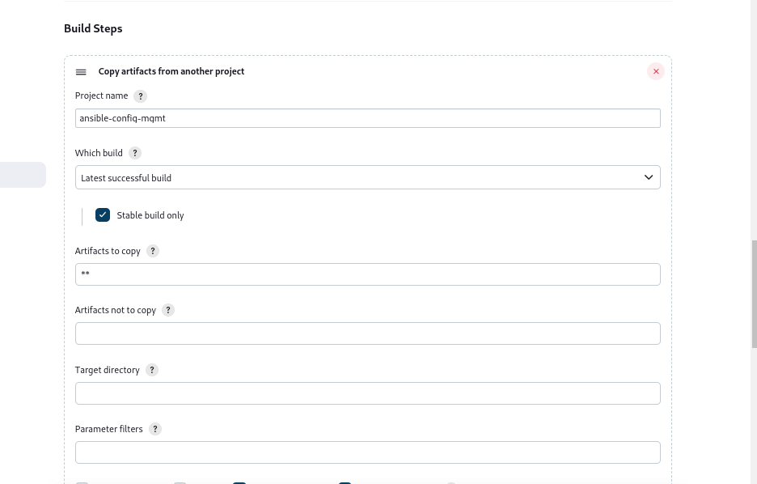
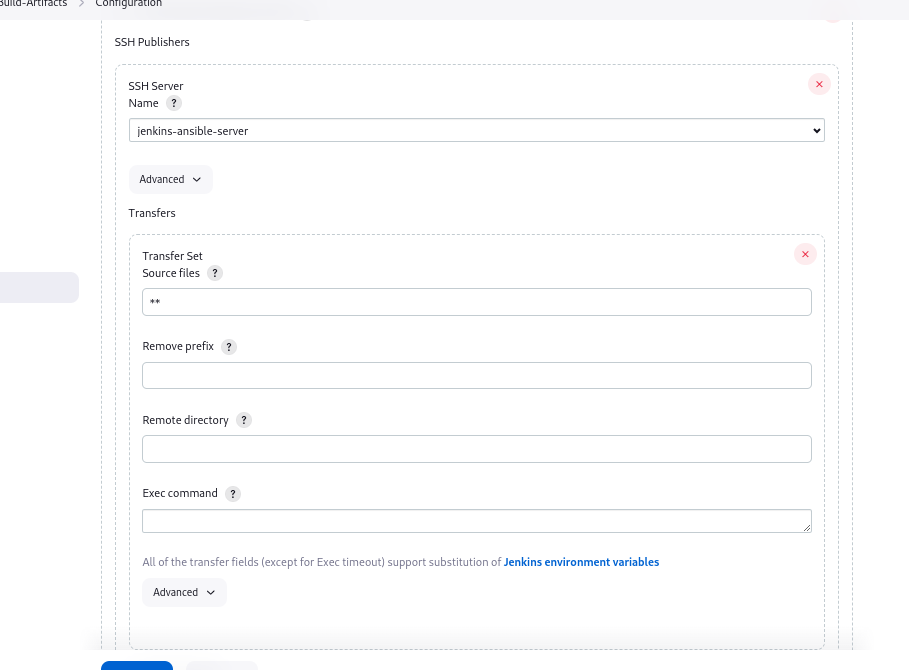

# Copy artifacts to Jenkins-Ansible server
 
In the jenkins-ansible server, create a directory for Ansible to store the artifacts in after succesfull build. Set correct permission for the directory to be accessible. On the Jenkins dashboard navigate to plugins, install `copy artifact`. Navigate to publish over ssh in manage jenkins from home dashboard. 

Click add, then click advanced to set  a different key to use for Jenkins-Ansible server.

Create a new freestyle project `Copy-Artifacts-After-Build`, click on discard oldbuilds and set builds to keep. Then set permission to copy arifacts from Ansible-build project, you can set multiple projects as well by using `,`. Set build triggers to build after the project is succesful. Add build steps to copy artifacts from another project. 
Set post build to copy artifacts over ssh, set directory of the new created directory. 

Make changes to the Ansible repo on github, the `Copy-Artifacts-After-Build` projects build should trigger automatically.