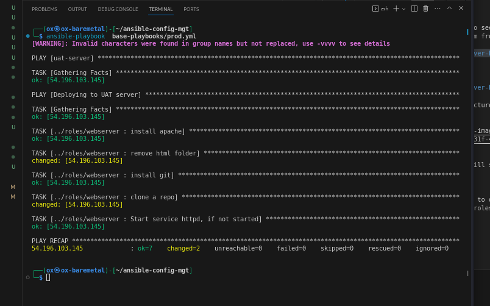

# Set up UAT server

Create a EC2 instance and name it  [uat-server](https://www.techtarget.com/searchsoftwarequality/definition/user-acceptance-testing-UAT). Just like we did for the previously created instances, copy the key to the `authorized_keys` file. Update the inventory file with the <public-ip-addr> and try to ping it if it's reachable. 

In the tasks folder under roles, open the main.yml file, update it with the below code:

```yml
---
# tasks file for webserver

- name: install apache
  become_user: root
  become: yes
  ansible.builtin.apt:
    name: "apache2"
    state: present

- name: remove html folder
  become_user: root
  become: yes
  ansible.builtin.command: rm -r /var/www/html

- name: install git
  become_user: root
  become: yes
  ansible.builtin.apt:
    name: "git"
    state: present

- name: clone a repo
  become_user: root
  become: yes
  ansible.builtin.git:
    repo: https://github.com/oxblixxx/news-homepage-main.git
    dest: /var/www/html
    force: yes

- name: Start service httpd, if not started
  become_user: root
  become: yes
  ansible.builtin.service:
    name: apache2
    state: started

```

# Reference Webserver Role

Create a file `uat-server.yml` in  nested-playbooks directory and update it with the below code:

```yml
---
- hosts: uat-webservers
  roles:
     - webserver
```

In the code above, it is referencing the [roles](https://docs.ansible.com/ansible/latest/playbook_guide/playbooks_reuse_roles.html) created.  

Remember our master playbook is in base-playbooks directory, reference uat-server.yml to be used there, create a new file, uat.yml. update the code:

```yml
- hosts: uat-server
- import_playbook: ../nested-playbook/uat-webservers.yml
```

Run your playbook against the changes, before merging and pushing to github

```sh 
ansible-playbook base-playbooks/uat.yml
```



Check the pubic-address of your uat server on your browser. 
http://UAT-Server-Public-IP-or-Public-DNS-Name>


Congratulations!
You have learned how to deploy and configure UAT Web Servers using Ansible imports and roles!
