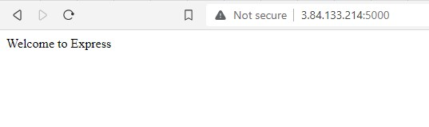
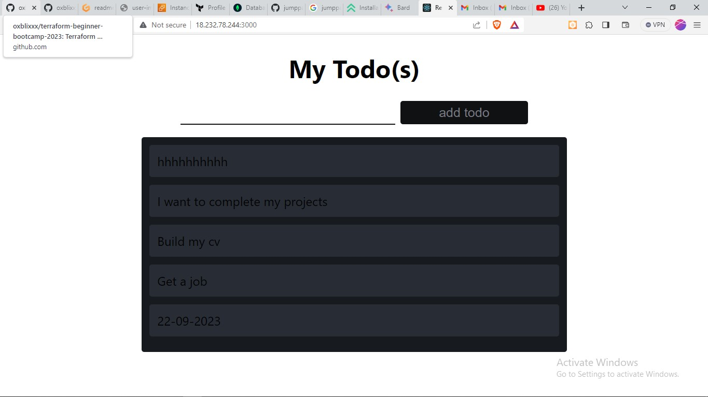

# Deploying a MERN Stack Application on AWS
This project demonstrates how to deploy a MERN (MongoDB, Express.js, React, Node.js) stack application on an AWS EC2 instance. The application to be deployed is a simple To-Do List that allows users to create, view, and delete tasks. Below is a step-by-step guide to setting up the environment, configuring the backend and frontend, and deploying the application.

---
## Technologies Used
- MongoDB: A NoSQL database used to store task data.
- Express.js: A backend framework for building RESTful APIs.
- React: A frontend library for building user interfaces.
- Node.js: A JavaScript runtime environment for executing server-side code.
- AWS EC2: A cloud computing service used to host the application.
---
## Setting up the MERN Environment
1. Set Up an AWS EC2 Instance
- Launch an EC2 instance on AWS.
- Configure security groups to allow inbound traffic on ports:
   - 22 (SSH): For connecting to the instance.
   - 3000 (React): For accessing the frontend.
   - 5000 (Express.js): For accessing the backend API.

SSH into the instance using the private key generated

```sh
ssh -i <key-pair-name> ubuntu@<ip-adddresss.
```

2. Install Node.js
Update and upgrade the Ubuntu distribution

```sh
sudo apt update -y && sudo apt upgrade -y
```

To Install Node.js and npm follow the instructions from the [NodeSource repository](https://github.com/nodesource/distributions). Below is the command executed below, at the point of deploying this project, `NODE_MAJOR=20` was used.

```sh
sudo apt-get install -y ca-certificates curl gnupg
sudo mkdir -p /etc/apt/keyrings
curl -fsSL https://deb.nodesource.com/gpgkey/nodesource-repo.gpg.key | sudo gpg --dearmor -o /etc/apt/keyrings/nodesource.gpg
```

Afterwards, create the Node.js repository with the below commands:

```sh
NODE_MAJOR=20
echo "deb [signed-by=/etc/apt/keyrings/nodesource.gpg] https://deb.nodesource.com/node_$NODE_MAJOR.x nodistro main" | sudo tee /etc/apt/sources.list.d/nodesource.list
```

Then install Node.js and npm and verify the installation.

```sh
sudo apt update -y && sudo apt upgrade -y
sudo apt install nodejs npm -y
node -v
npm -v

```

3. Set Up the Backend
Create a project directory for the to-do-list app, then initialize NPM in that directory.

```sh
mkdir To-do
cd To-do
npm init
```

Also setup  Express.js and dotenv:

```sh
npm install express dotenv
```

Finally we installed the dependecies for the MERN stack, now let's proceed to setup the codes. Create an index.js file and add the backend code:

```sh
nano index.js
```

```js
const express = require('express');
require('dotenv').config();

const app = express();

const port = process.env.PORT || 5000;

app.use((req, res, next) => {
res.header("Access-Control-Allow-Origin", "\*");
res.header("Access-Control-Allow-Headers", "Origin, X-Requested-With, Content-Type, Accept");
next();
});

app.use((req, res, next) => {
res.send('Welcome to Express');
});

app.listen(port, () => {
console.log(`Server running on port ${port}`)
});
```

It's time to start the express server, in the directory of the to-do app. 

```sh
node index.js
```

Open your browser. access the express instance with your :5000. Remember we specified port 5000.


---

## ROUTES
Routes are used to define how the application will respond to different requests. What actions do you want your applications to take? For the to-do app, we want to do:

- Create a new task
- See list of all created tasks
- Delete tasks
For each task, routes needs to be created for the endpoints. The tasks will be associated with the endpoints using different http requests method(GET, PUT, POST, DELETE). In the to-do folder, Make a folder routes and create an api file in the directory and update the `api.js` file with the below code.

```sh
mkdir routes
cd routes
touch api.js
```

```js
const express = require ('express');
const router = express.Router();

router.get('/todos', (req, res, next) => {

});

router.post('/todos', (req, res, next) => {

});

router.delete('/todos/:id', (req, res, next) => {

})

module.exports = router;
```

---

## MODELS
Models help you to ensure that all documents in a collection have the same fields and that the values of those fields are of the correct type. This can help you to write cleaner, more efficient code and to avoid errors.

Models provide a convenient way to perform CRUD (create, read, update, and delete) operations on documents. We will also use models to define the database schema.

Change directory to the to-do folder, install mongoose which is a MongoDB library, it makes it easier to work with MongoDB.

```sh
npm install mongoose
```

In the to-do directory, create a folder for models, a file named **model.js** and update model.js with the below code.

```sh
mkdir models && nano model.js
```

```js
const mongoose = require('mongoose');
const Schema = mongoose.Schema;

//create schema for todo
const TodoSchema = new Schema({
action: {
type: String,
required: [true, 'The todo text field is required']
}
})

//create model for todo
const Todo = mongoose.model('todo', TodoSchema);

module.exports = Todo;
```

Remember we created a Routes folder earlier and created a file api.js in it. Update the api.js code to make use of the model. In short, delete the code and put in the below code.

```js
const express = require ('express');
const router = express.Router();
const Todo = require('../models/model');

router.get('/todos', (req, res, next) => {

//this will return all the data, exposing only the id and action field to the client
Todo.find({}, 'action')
.then(data => res.json(data))
.catch(next)
});

router.post('/todos', (req, res, next) => {
if(req.body.action){
Todo.create(req.body)
.then(data => res.json(data))
.catch(next)
}else {
res.json({
error: "The input field is empty"
})
}
});

router.delete('/todos/:id', (req, res, next) => {
Todo.findOneAndDelete({"_id": req.params.id})
.then(data => res.json(data))
.catch(next)
})

module.exports = router;
```

---
4. Setting Up MongoDB
Sign up for a MongoDB Atlas account. Create a free-tier cluster and configure a database user. Fetch the connection string, add the connection string to a .env file:

```
cd to-do
nano .env
DB = 'mongodb+srv://<username>:<password>@cluster0.nhraeok.mongodb.net/?retryWrites=true&w=majority'
```

Then update index.js with the below code

```js
const express = require('express');
const bodyParser = require('body-parser');
const mongoose = require('mongoose');
const routes = require('./routes/api');
const path = require('path');
require('dotenv').config();

const app = express();

const port = process.env.PORT || 5000;

//connect to the database
mongoose.connect(process.env.DB, { useNewUrlParser: true, useUnifiedTopology: true })
.then(() => console.log(`Database connected successfully`))
.catch(err => console.log(err));

//since mongoose promise is depreciated, we overide it with node's promise
mongoose.Promise = global.Promise;

app.use((req, res, next) => {
res.header("Access-Control-Allow-Origin", "\*");
res.header("Access-Control-Allow-Headers", "Origin, X-Requested-With, Content-Type, Accept");
next();
});

app.use(bodyParser.json());

app.use('/api', routes);

app.use((err, req, res, next) => {
console.log(err);
next();
});

app.listen(port, () => {
console.log(`Server running on port ${port}`)
})
```

Then run command to see if the server is connected.

```sh
node index.js
```

If it's succesfully connected, it will display "Database connected succesfully"

5. Set Up the Frontend
Now the interface for the client to interact with the application via API whith ReactJS will be used for the frontend. In the root directory of to-do, run the command below:

```sh
npx create-react-app todo-frontend
```

After running this command, a new folder will be created. Two dependencies also will be installed for use

- Concurently - This allows multiple commands to be run simultaneously on the same terminal.

```js
npm install concurrently --save-dev
```

- nodemon - It runs and monitors the server for changes and restarts it if there is any.

```js
npm install nodemon --save-dev
```

In the package.json file in the to-do directory, update the scripts block with the code below.

```json
"scripts": {
"start": "node index.js",
"start-watch": "nodemon index.js",
"dev": "concurrently \"npm run start-watch\" \"cd client && npm start\""
},
```
Thereafter, configure the proxy in the todo-frontend created with npx create-react-app. Add the below proxy block in the package.json file. NB- What this proxy does is to allow the application to be acessible from the server url `http://localhost:5000`

```sh
cd todo-frontend
ls -al
nano package.json
```

```sh
"proxy": "http://localhost:5000"
```

```sh
cd todo-frontend
ls -al
nano package.json
```

Change directory to-do root folder, run:

```sh
npm run dev
```

# CREATING REACT COMPONENTS
Remember we ran the command "npx create-react-app todo-frontend". From the to-do directory, move to the src folder and make a components folder:

```sh
cd todo-frontend
cd src
mkdir components
cd components
```

Create the files in the components folder, Todo.js, Input.js, ListTodo.js

```sh
touch Todo.js Input.js ListTodo.js
```

Open the files with your favourite text editor, put in the below codes respectively:

**Todo.js**

```js
import React, {Component} from 'react';
import axios from 'axios';

import Input from './Input';
import ListTodo from './ListTodo';

class Todo extends Component {

state = {
todos: []
}

componentDidMount(){
this.getTodos();
}

getTodos = () => {
axios.get('/api/todos')
.then(res => {
if(res.data){
this.setState({
todos: res.data
})
}
})
.catch(err => console.log(err))
}

deleteTodo = (id) => {

    axios.delete(`/api/todos/${id}`)
      .then(res => {
        if(res.data){
          this.getTodos()
        }
      })
      .catch(err => console.log(err))

}

render() {
let { todos } = this.state;

    return(
      <div>
        <h1>My Todo(s)</h1>
        <Input getTodos={this.getTodos}/>
        <ListTodo todos={todos} deleteTodo={this.deleteTodo}/>
      </div>
    )

}
}

export default Todo;
```

**Input.js**

```js
import React, { Component } from 'react';
import axios from 'axios';

class Input extends Component {

state = {
action: ""
}

addTodo = () => {
const task = {action: this.state.action}

    if(task.action && task.action.length > 0){
      axios.post('/api/todos', task)
        .then(res => {
          if(res.data){
            this.props.getTodos();
            this.setState({action: ""})
          }
        })
        .catch(err => console.log(err))
    }else {
      console.log('input field required')
    }

}

handleChange = (e) => {
this.setState({
action: e.target.value
})
}

render() {
let { action } = this.state;
return (
<div>
<input type="text" onChange={this.handleChange} value={action} />
<button onClick={this.addTodo}>add todo</button>
</div>
)
}
}

export default Input
```

**ListTodo**
```
import React from 'react';

const ListTodo = ({ todos, deleteTodo }) => {

return (
<ul>
{
todos &&
todos.length > 0 ?
(
todos.map(todo => {
return (
<li key={todo._id} onClick={() => deleteTodo(todo._id)}>{todo.action}</li>
)
})
)
:
(
<li>No todo(s) left</li>
)
}
</ul>
)
}

export default ListTodo
```

We need to update the App.css file to our to-do css files. Change the directory to the css folder

```
cd ..
ls -al
```

You should see App.css and App.js, we are going to update both files.

**App.css**
```css
.App {
text-align: center;
font-size: calc(10px + 2vmin);
width: 60%;
margin-left: auto;
margin-right: auto;
}

input {
height: 40px;
width: 50%;
border: none;
border-bottom: 2px #101113 solid;
background: none;
font-size: 1.5rem;
color: #787a80;
}

input:focus {
outline: none;
}

button {
width: 25%;
height: 45px;
border: none;
margin-left: 10px;
font-size: 25px;
background: #101113;
border-radius: 5px;
color: #787a80;
cursor: pointer;
}

button:focus {
outline: none;
}

ul {
list-style: none;
text-align: left;
padding: 15px;
background: #171a1f;
border-radius: 5px;
}

li {
padding: 15px;
font-size: 1.5rem;
margin-bottom: 15px;
background: #282c34;
border-radius: 5px;
overflow-wrap: break-word;
cursor: pointer;
}

@media only screen and (min-width: 300px) {
.App {
width: 80%;
}

input {
width: 100%
}

button {
width: 100%;
margin-top: 15px;
margin-left: 0;
}
}

@media only screen and (min-width: 640px) {
.App {
width: 60%;
}

input {
width: 50%;
}

button {
width: 30%;
margin-left: 10px;
margin-top: 0;
}
}
```

Also, in the src directory open the index.css

```
nano index.css
```

Then Copy and paste the code below:

```css
body {
margin: 0;
padding: 0;
font-family: -apple-system, BlinkMacSystemFont, "Segoe UI", "Roboto", "Oxygen",
"Ubuntu", "Cantarell", "Fira Sans", "Droid Sans", "Helvetica Neue",
sans-serif;
-webkit-font-smoothing: antialiased;
-moz-osx-font-smoothing: grayscale;
box-sizing: border-box;
background-color: #282c34;
color: #787a80;
}

code {
font-family: source-code-pro, Menlo, Monaco, Consolas, "Courier New",
monospace;
}
```

In the App.js, update it with the below code

```js
import React from 'react';

import Todo from './components/Todo';
import './App.css';

const App = () => {
return (
<div className="App">
<Todo />
</div>
);
}

export default App;
```

Now change the directory to the to-do folder root directory.

```
cd ../..
pwd
```

When in the directory, run: `npm run dev`

If there all went well and there wsa no errors, we should have a fully functional to-do website.


Access the application in your browser at http://<public-ip>:3000.

