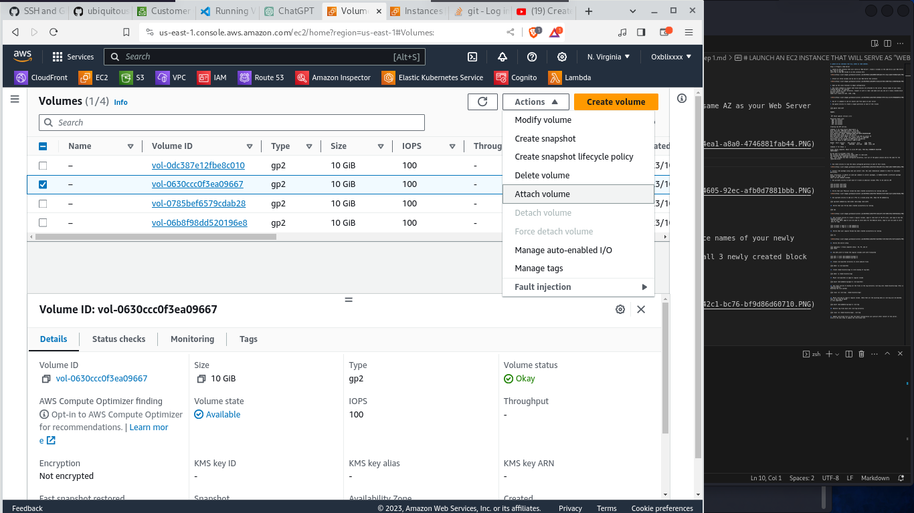
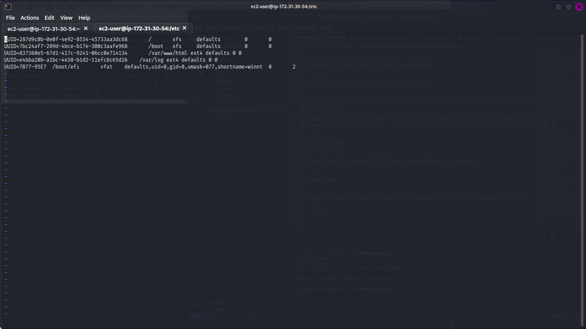

In this project, we will be implementing `Three-tier-architecture`. 

- Presentation Tier (User Interface): This is the topmost layer that interacts with users. It's responsible for presenting information to the user and collecting user inputs. In web applications, this tier often involves the graphical user interface (GUI) that users interact with.

- Application Tier (Logic Tier): Also known as the business logic or middle tier, this layer contains the application logic responsible for processing user inputs, performing calculations, and managing data flow between the presentation and data tiers. It essentially implements the core functionalities of the application.This is the backend program
- Data Tier (Storage Tier): This is the bottom layer that deals with data storage and retrieval. It involves databases or other data storage systems where information is persisted. The data tier is responsible for managing and storing the application's data. Layer for computer data storage and data access. 

### LAUNCH AN EC2 INSTANCE FOR THE SERVER
Spin up an ec2 instance, in this project, we will be working with the linux distro `Red-hat`. Unlike ubuntu, to login to this distro, it's `ec2-user` and not as `ubuntu` as in for ubuntu distro. Allow http from all traffic.

Create 3 volumes to be attached with the `web-server` instance of 10GIB size each. Ensure to create the volumes in the same AZ the `web-server` is created in. On the `EC2 Dashboard` navigate to `Volumes` under EBS. After creating each volumes choose each volumes, click on actions then attach, choose the `web-server` instance to attach to. Repeat the same step for the 2 other volumes.


SSH into the instance, to see a list of block devices on your intance use the:

```sh
lsblk
```

This outputs the volumes, mounted devices are located in /dev directory. To see the mounted volumes that was attached:

```sh
ls -al /dev/xvd*
```

You can use `fdisk` command to see more details, ensure to use the sudo command with it.

```sh
sudo fdisk -l
```

Also use the `df -h` command to see the `available space and space used`.

There are various types [disk partitioning utility](https://www.ubuntupit.com/best-linux-partition-manager-tools/), however we will be using the `Gdisk utility` 

Create a partition on the volumes individualy using, then enter `?` on your terminal for help:

```
sudo gdisk /dev/xvdg
```

You get this output shown on your terminal:

```
Command (? for help): ?
b       back up GPT data to a file
c       change a partition's name
d       delete a partition
i       show detailed information on a partition
l       list known partition types
n       add a new partition
o       create a new empty GUID partition table (GPT)
p       print the partition table
q       quit without saving changes
r       recovery and transformation options (experts only)
s       sort partitions
t       change a partition's type code
v       verify disk
w       write table to disk and exit
x       extra functionality (experts only)
?       print this menu

```

When you enter `n` it creates a new partition. In [gdisk](https://edumotivation.com/how-to-create-guid-partitions-in-linux/). You can create up to 128 partitions.

```
Command (? for help): n
Partition number (1-128, default 1): 
```

Pressing enter for the `First sector` uses the default `34`. For the last sector, calculate the size you want to allocate to the partition. In each sector is `512 bytes`. We created a volume of `10GIB` we want to create a partition of `5GIB`. 

Here is the calculation:
```
5GIB * 1024MB * 1024KB * 1024BYTES = 5368709120 / 512bytes = 10485760sectors
```

NB: When creating a second partition, the second partition starts from the previously ended sector, for instance to create 2.5GIB partion. Simply add 10485760+  5242880 = 15728640. This creates 2.5GIB partiton and with a free space of 2.5GIB available.


The next output shows a list of partition type codes that you can choose for your partition. Each code corresponds to a specific type of partition. Since you're creating a Linux filesystem, you can use the code 8300.


On the gdisk interactive mode, enter `p` to print the partition table and see the Total free space left. You can change the name of the newly created partition with `c`. 

```sh
Command (? for help): C
Using 1
Enter name: web-server

Command (? for help): p
Disk /dev/xvdh: 20971520 sectors, 10.0 GiB
Sector size (logical/physical): 512/512 bytes
Disk identifier (GUID): DC269E0F-4463-4AF7-8D9D-69296E6C9895
Partition table holds up to 128 entries
Main partition table begins at sector 2 and ends at sector 33
First usable sector is 34, last usable sector is 20971486
Partitions will be aligned on 2048-sector boundaries
Total free space is 10487740 sectors (5.0 GiB)

Number  Start (sector)    End (sector)  Size       Code  Name
   1            2048        10485760   5.0 GiB     8300  web-server

```

Use `w` to overwrite your existing partition and proceed to save your process with `Y`.

Repeat the same process for the rest of the 2 other partitions. Use the `lsblk` command to see the newly created partitions

```sh
NAME    MAJ:MIN RM  SIZE RO TYPE MOUNTPOINTS
xvda    202:0    0   10G  0 disk 
├─xvda1 202:1    0    1M  0 part 
├─xvda2 202:2    0  200M  0 part /boot/efi
├─xvda3 202:3    0  500M  0 part /boot
└─xvda4 202:4    0  9.3G  0 part /
xvdf    202:80   0   10G  0 disk 
└─xvdf1 202:81   0    5G  0 part 
xvdg    202:96   0   10G  0 disk 
├─xvdg1 202:97   0    5G  0 part 
└─xvdg2 202:98   0  2.5G  0 part 
xvdh    202:112  0   10G  0 disk 
└─xvdh1 202:113  0    5G  0 part 

```

We will be using another linux utility `lvm2`, to install this utility run:

```sh
sudo yum install lvm2
```

[LVM2 utility](https://www.tecmint.com/manage-and-create-lvm-parition-using-vgcreate-lvcreate-and-lvextend/) is an improved version of the original LVM, providing enhanced features and capabilities. Here's an over view of LVM:

- Physical Volumes (PV): Physical storage devices, such as hard drives or partitions, are designated as physical volumes. These can be combined to create volume groups.

- Volume Groups (VG): Volume groups are created by combining one or more physical volumes. They act as a pool of storage from which logical volumes can be allocated.

- Logical Volumes (LV): Logical volumes are analogous to partitions. They are created within volume groups and can be resized dynamically.

Common LVM2 Commands:

```sh
lvmdiskcan: command to check for available partitions.
pvcreate: Initializes physical volumes for use in LVM.
vgcreate: Creates a volume group, combining one or more physical volumes.
lvcreate: Creates logical volumes within a volume group.
lvresize: Resizes logical volumes.
lvdisplay, vgdisplay, pvdisplay: Display information about logical volumes, volume groups, and physical volumes, respectively.
vgs: volume group show
```

To see a list of available partitions:

```sh
$ sudo lvmdiskscan
  /dev/xvda2 [     200.00 MiB] 
  /dev/xvda3 [     500.00 MiB] 
  /dev/xvda4 [       9.31 GiB] 
  /dev/xvdf1 [      <5.00 GiB] 
  /dev/xvdg1 [      <5.00 GiB] 
  /dev/xvdg2 [      <2.50 GiB] 
  /dev/xvdh1 [      <5.00 GiB] 
  0 disks
  7 partitions
  0 LVM physical volume whole disks
  0 LVM physical volumes

```

Use the `pvcreate` command to create physical volumes

```sh
sudo pvcreate /dev/xvdf1
sudo pvcreate /dev/xvdg1
sudo pvcreate /dev/xvdh1
```

We created a total of `15GiB` physical volume. Use the `lvmdiskscan` command to see the list of created physical volume.

To create a volume-group, use the `vgcreate` command and name the group `webdata-vg`

```sh
sudo vgcrete webdata-vg /dev/xvdf1 /dev/xvdg1 /dev/xvdh1
```

Use the `vgs` command to show list of volume groups && use `sudo vgdisplay -v` to have a detailed view

Create 2 logical volume from the webdata-vg 

```
sudo lvcreate -n apps-lv -L 10G webdata-vg
sudo lvcreate -n logs-lv -L 4G webdata-vg
```

Verify that logical volume as been created with the `sudo lvdisplay -v`

[Format](https://phoenixnap.com/kb/linux-format-disk) the logical volumes, Ext4 is native to Linux and may have limited compatibility with Windows without additional software.

```sh
sudo mkfs -t ext4 /dev/webdata-vg/apps-lv
sudo mkfs -t ext4 /dev/webdata-vg/logs-lv
```

NB:
- mkfs: Make file system.
- t : type

Create a new directory /var/www/html

```sh
sudo mkdir -p /var/www/html
```

Mount apps-lv to /var/www/html

```sh
sudo mount /dev/webdata-vg/apps-lv /var/www/html
```

Before mounting  /dev/webdata-vg/logs-lv to /var/log, we need to backup the present files, because mounting wipes the current data mounting the new partition. Use the [rsync](https://www.digitalocean.com/community/tutorials/how-to-use-rsync-to-sync-local-and-remote-directories) utility for this:

```sh
sudo rsync -av /var/log/. /home/recovery/logs/
```

Then mount the logical volume to /var/log.

NB: Back up your present files before mounting

```sh
sudo mount /dev/webdata-vg/logs-lv /var/log
```

Restore log files back into /var/log directory

```sh
sudo rsync -av /home/recovery/logs/. /var/log
```

Update /etc/fstab file so that the mount configuration will persist after restart of the server.

Change directory /etc/. Open  `fstab` with vi as nano isn't installed by default on Cent-os

```
vi /etc/fstab
```

Exit `fstab`, grab the UUID of the mounted volumes by running:

```
sudo blkid
```

Copy the UUID excluding the quotations, update your /etc/fstab looking like this




Test the configuration and reload the daemon, 

```sh
sudo mount -a
sudo systemctl daemon-reload
```

- sudo mount -a: will attempt to mount all filesystems listed in /etc/fstab that are not already mounted. 
- sudo systemctl daemon-reload: to reload the systemd manager configuration. 

Run `df -h`, you should have a similar output as this:

```sh
Filesystem                        Size  Used Avail Use% Mounted on
devtmpfs                          4.0M     0  4.0M   0% /dev
tmpfs                             385M     0  385M   0% /dev/shm
tmpfs                             154M  5.8M  148M   4% /run
/dev/xvda4                        9.4G  1.3G  8.1G  14% /
/dev/xvda3                        495M  153M  343M  31% /boot
/dev/xvda2                        200M  8.0K  200M   1% /boot/efi
tmpfs                              77M     0   77M   0% /run/user/1000
/dev/mapper/webdata--vg-logs--lv  3.9G   24K  3.7G   1% /var/www/html
/dev/mapper/webdata--vg-apps--lv  9.8G   40K  9.3G   1% /var/log

```


