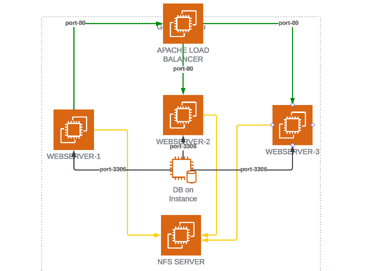

This project illustrates the implementation of NFS Mount point across webservers for `data centralization` and using apache as a `loadbalancer`. Also, in this project you will implement a solution that consists of following components:

1. CSP: AWS
2. Webserver Linux: Ubuntu
3. Database Server: Ubuntu 20.04 + MySQL
4. Programming Language: PHP
5. Code Repository: GitHub

# REFS 
[HOW TO SET UP A NFS](https://tldp.org/HOWTO/NFS-HOWTO/server.html)

