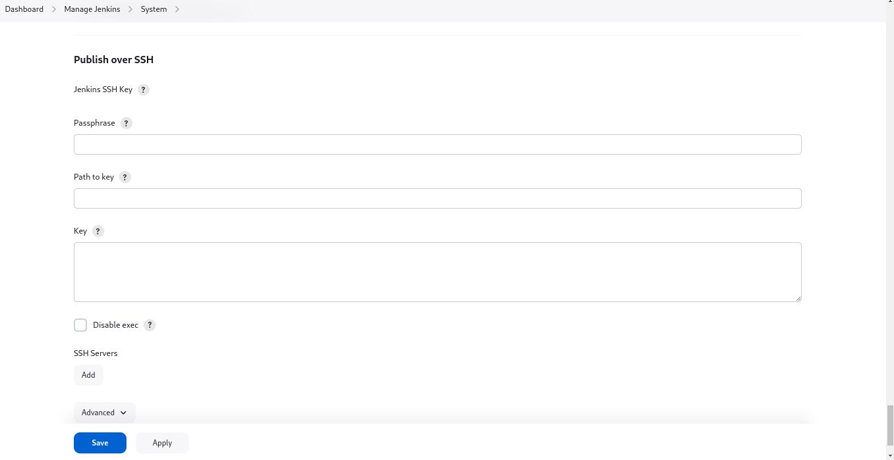
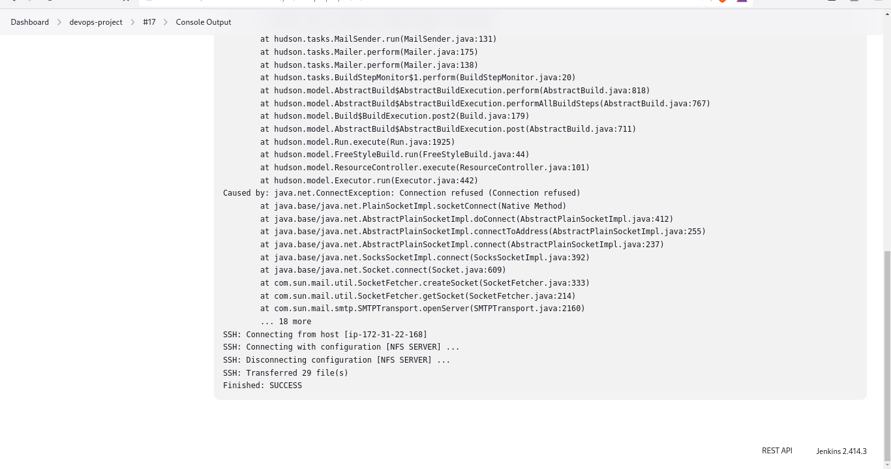

## COPY ARTIFACTS TO NFS SERVER
1. SSH into your NFS server, create a ssh key:

```sh
ssh-keygen 
```

cd into .ssh directory, there are various ways to install public key for remote login using the `ssh-copy-id` command. But we will be using the a different approach. Enter the command `ls` to see there is a file `authorized_keys`. Copy the public key `id_rsa.pub` to the `authorized_keys` folder.

```sh
cat id_rsa.pub >> ~/.ssh/authorized_keys
```

NB: When you do this, you won't be able to login with the your aws key-pair. It invalidates the keypair used on the `aws console`.So, copy the private key `id_rsa` to a file from the directory you ssh from as <file_name>.pem, run "chmod 400 <file_name>.pem", then you can ssh using the `ssh -i "file_name.pem` ubuntu@<public_ip_address>.


2. Return to Jenkins main dashboard, install [publish over ssh](https://plugins.jenkins.io/publish-over-ssh/) on Jenkins server, navigate to manage jenkins>plugins>available plugins, then install `publish over ssh`

3. Return to Jenkins dashboard, navigate to manage jenkins>system. Scroll down locate `public over ssh`



Put in the details of the NFS server. Under key, paste the private key there `id_rsa`. Add SSH server:

- hostname: can be the NFS private ip address
- username: user to authenticate login, ubuntu is used since we didn't create any user yet
- remote directory: /mnt/apps/html

NB: Use `pwd` to get current working directory to navigate to and the directory should have a write priviledge set. Priviledges depends on the use case and security should be put in consideration. `sudo chmod 775 /path/to/file`

Ensure to test configuration with a return of success before applying and save.

4. Open the project/job, navigate to configure>post-build-action. Since we want all files to be copied, we will use `**`

Apply the configuration then save. Make a change from your github repo, commit changes. You should get a succesfully build



Proceed to check the destination directory in your NFS server, if the files are there, Congratulations!!!

You have just implemented your first Continous Integration solution using Jenkins CI. We will be checking other CI tools such as Github actions, Circle CI...
