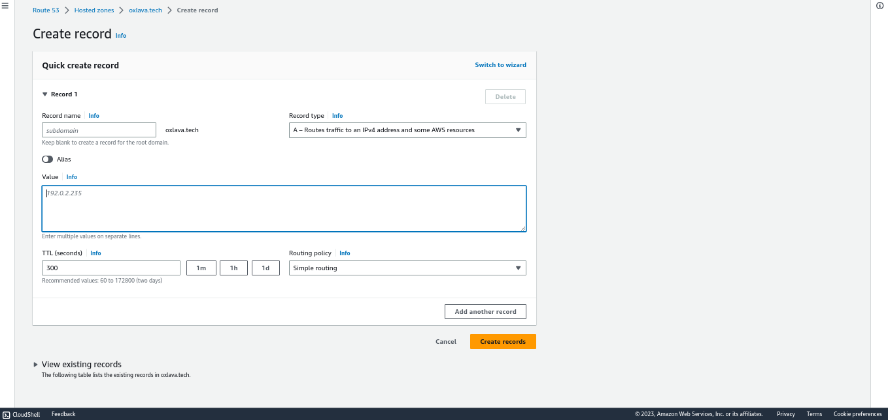

## REGISTER A DOMAIN NAME
There are loads of domain providers, cloud services provides domain names as AWS has `route53` service to provision that. There are other providers which ofcourse aren't cloud providers such as `godaddy`, `namecheap`...

Create a domain of your choice with your preferred name. 

Assign an Elastic IP to your Nginx LB server and associate your domain name with this Elastic IP

You might have noticed, that every time you restart or stop/start your EC2 instance – you get a new public IP address. When you want to associate your domain name – it is better to have a static IP address that does not change after reboot. Elastic IP is 
the solution for this problem.

NB. You get charged only for an EIP when it's not in use.

Create an [A record](https://support.dnsimple.com/articles/a-record/) to point to the public-ip-address of the `nginx-lb-server`.

Configure Nginx to recognize your new domain name. Update your nginx.conf with server_name www.<your-domain-name.com> instead of server_name www.domain.com

## CREATE HOSTED ZONE IN ROUTE53
Return to your AWS console, navigate to `route53` services> Create a hosted zone. Put in the doman name that you registered earlier like `oxlava.tech` and not with the subdomain `wwww`. It's type is `public hosted zone`. After creating a hosted zone you are provided with 4 `nameservers`. Create a `A record ` setting the value as the <public-ip-address> nginx lb.



Return to your domain provider, copy and paste the 4 nameservers from the hosted zone.

## CONFIGURE SSL
SSH to the nginx-lb server, then Configure Nginx to recognize your new domain name
Update your nginx.conf with server_name www.<your-domain-name.com> instead of server_name www.domain.com

 Install certbot and request for an SSL/TLS certificate
Make sure snapd service is active and running

```sh
sudo systemctl status snapd
```

Install certbot

```sh
sudo snap install --classic certbot
```

Request your certificate (just follow the certbot instructions – you will need to choose which domain you want your certificate to be issued for, domain name will be looked up from nginx.conf file so make sure you have update your `nginx.conf`.


```sh
sudo ln -s /snap/bin/certbot /usr/bin/certbot
sudo certbot --nginx
```

You should get something similar with a different expiry date shown, proceed to check your website if it's secured:

```sh
This certificate expires on 2024-01-19.
These files will be updated when the certificate renews.
Certbot has set up a scheduled task to automatically renew this certificate in the background.

Deploying certificate
Successfully deployed certificate for devops-project.oxlava.tech to /etc/nginx/nginx.conf
Congratulations! You have successfully enabled HTTPS on https://devops-project.oxlava.tech

- - - - - - - - - - - - - - - - - - - - - - - - - - - - - - - - - - - - - - - -
If you like Certbot, please consider supporting our work by:
 * Donating to ISRG / Let's Encrypt:   https://letsencrypt.org/donate
 * Donating to EFF:                    https://eff.org/donate-le
- - - - - - - -
```


NB: DOUBLCE CHECK TO HAVE NOT ALLOWED TRAFFIC FROM PORT 80 TO THE INTERNET ON THE WEBSERVERS, AND IT SHOULD ONLY BE FROM THE NGINX-LB


## LETS-ENCRYPT RENEWAL
LetsEncrypt certificate is valid for 90 days, so it is recommended to renew it at least every 60 days or more frequently. We will be automating this with [cronjob](https://crontab.guru/). You can read about [cron here.](https://www.geeksforgeeks.org/crontab-in-linux-with-examples/)

The command to renew is `sudo certbot renew` you can test it in dry-run mode

```sh
sudo cerbot renew --dry-run
```

Edit the crontab file, choose your editor:

```sh
crontab -e
```

add the following line:

```sh
* */12 * * *   root /usr/bin/certbot renew > /dev/null 2>&1
```

Edit the interval to your preference, self study from this video to undderstand more about cronjob  (https://youtu.be/4g1i0ylvx3A) and (https://www.youtube.com/watch?v=v952m13p-b4)


Congratulations!
You have just implemented an Nginx Load Balancing Web Solution with secured HTTPS connection with periodically updated SSL/TLS 
certificates.